# Pyl-Poil — FrHack! 2026 · Challenge 4 ANFR × ISEP

**Pyl-Poil** est l'outil Python développé par l'équipe pour repérer des **structures susceptibles de supporter des installations radioélectriques** dans des orthophotos aériennes IGN, géolocaliser les détections, les comparer au référentiel ANFR et faire émerger des candidats à examiner.

Le dépôt est organisé comme un outil réutilisable : paramètres centralisés, scripts d'installation/utilisation, deux modèles livrés, annotations humaines, résultats quantitatifs, figures clés, tests et carte HTML interactive.

> **Précaution essentielle** — une détection sans correspondance ANFR proche est un **candidat visuel**, jamais une preuve automatique de site radioélectrique non déclaré. Elle peut être un faux positif, un support sans installation radio, un décalage géographique/temporel, une installation récente/démantelée ou une erreur de classification.

## Résultats en un coup d'œil

| Étape | Résultat |
|---|---:|
| Catalogue ANFR Yvelines | **1 464** supports |
| Dataset sélectionné | **300** supports, split spatial 210 / 45 / 45 |
| Niveau 1 — mAP50 sur test humain initial | **0,0126** |
| Niveau 2 — train revu manuellement | **210** images, 165 utilisables |
| Niveau 2 — validation revue | **45** images, 35 utilisables |
| Niveau 2 — holdout final indépendant | **25** images, 23 utilisables |
| Modèle final — mAP50 holdout | **0,2495** |
| Modèle final — mAP50-95 holdout | **0,1138** |
| Niveau 3 — détections brutes | **174** |
| Après filtre ≥150 m | **53** |
| Après déduplication 30 m | **46** candidats uniques |
| Revue humaine | **27 plausibles**, 17 FP, 2 incertains |
| Cas retenus | **D003, D006, D007** |

Les chiffres consolidés sont dans `code/results/metrics/`, les illustrations dans `code/results/figures/` et la carte dans `code/results/level3/carte_candidats_finale.html`.

## Installation

### Sur Onyxia (Disponible uniquement pour les étudiants):
 1. Créez votre compte Onyxia
 
 2. Lancez la création d'un service Vscode-python-gpu
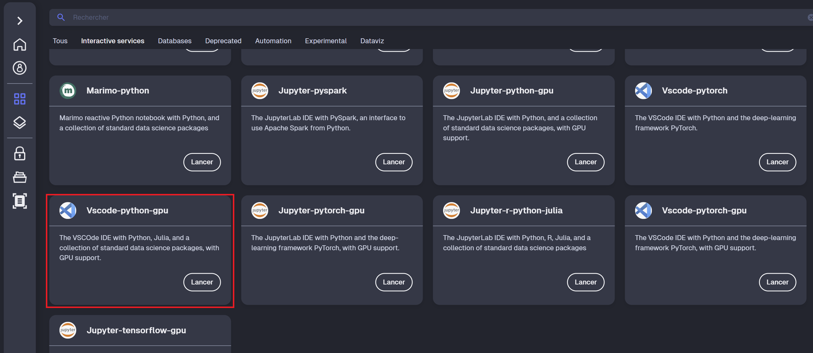

 3. Sélectionnez le volet "Initialization scripts" puis, après l'ouverture de celui-ci, mettez le lien suivant dans le champs "Use a custom script (URL)" :
 https://raw.githubusercontent.com/Landrysgl/Hackathon_FRHACK_26/main/onyxia-init.sh

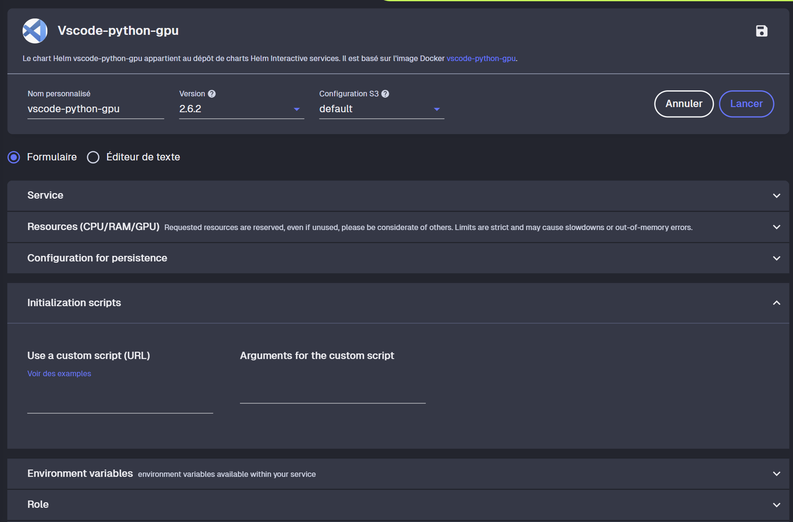

 4. Sélectionnez ensuite le volet "Network Acess", cliquez sur "Enable access to your service through specific ports" puis entrez le nombre 8501 au niveau du champs "Port 1"
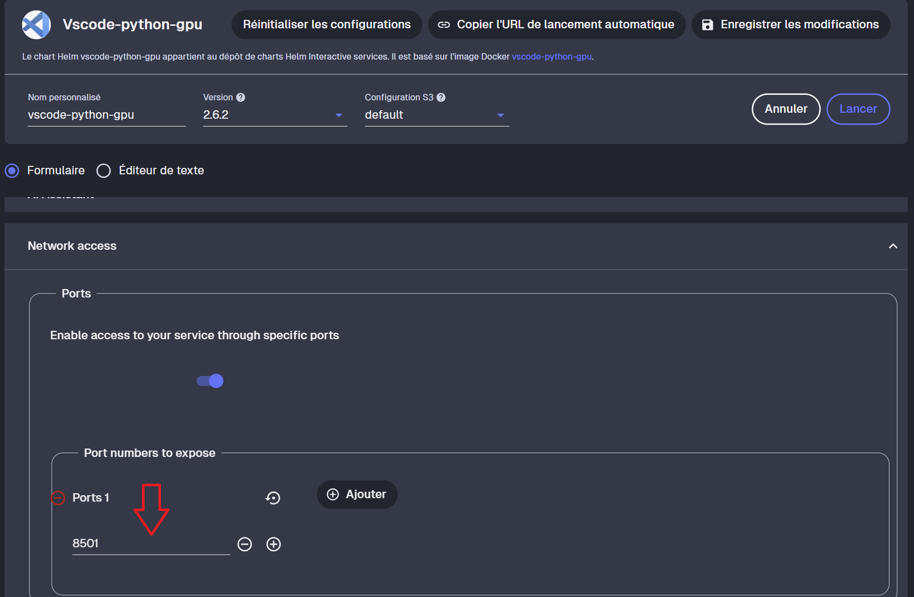

 5. Cliquez sur "Enregistrer les modifications" puis lancez votre service. Patientez quelques temps et suivez les étapes nécéssaires à votre entrée dans le service.
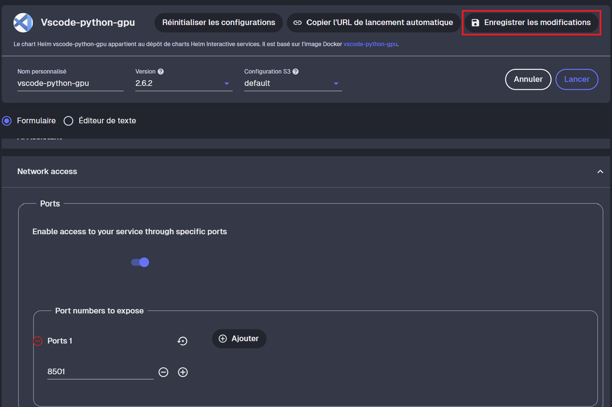

 6. Une fois à l'intérieur du service, clonez le dépôt git puis exécutez dans le dossier "Hackathon_FRHACK_26" les commandes suivantes :
 python -m pip uninstall -y opencv-python
 python -m pip install opencv-python-headless
 python -m streamlit run app.py

 7. Retournez dans votre menu principal, allez dans l'onglet "Mes services", cliquez sur le bouton "ouvrir" figurant au niveau de votre service et cliquez sur les mots "ce lien" parlant du port 8501 et affichés en couleur
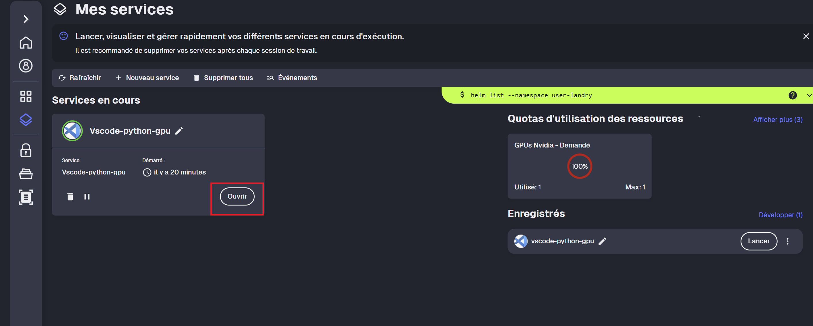
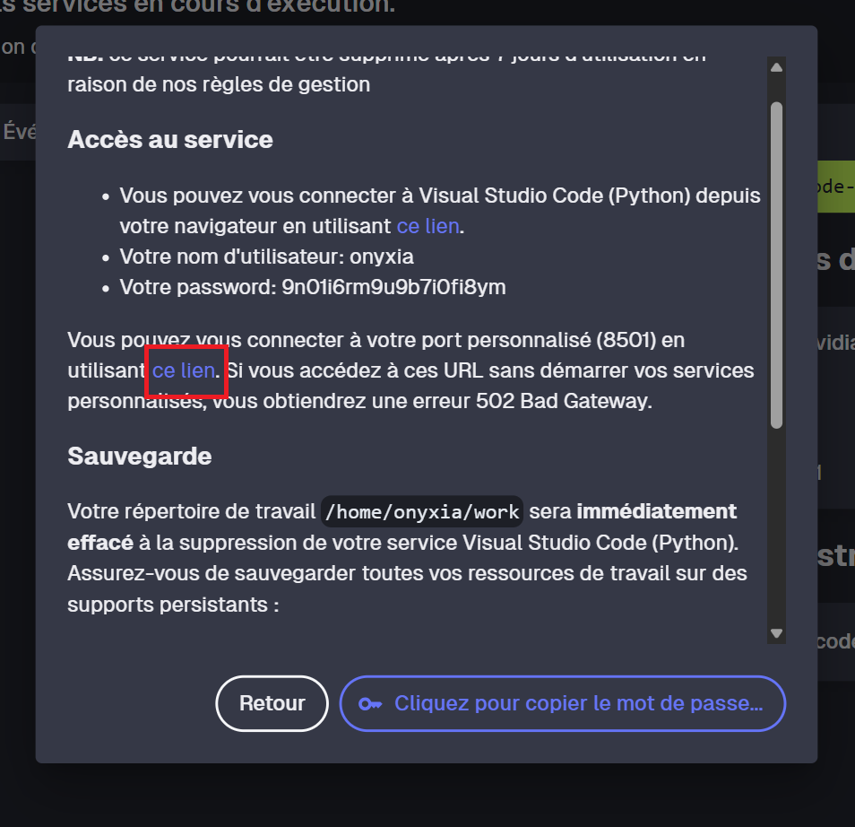

 8. Profitez enfin de notre outil (Rendez vous à la prochaine partie pour s'en servir)


### Sur votre ordinateur:
 1. Ouvrez votre IDE préféré (Ex: Visual Studio Code)

 2. Clonez le dépot git

 3. Ouvrez votre terminal dirigez vous vers le dossier "Hackathon_FRHACK_26" et lancez la commande suivante :
 python -m pip install -r requirements.txt

 4. Entrez la commande suivante :
python -m streamlit run app.py

 5. Patientez quelques secondes et cliquez, tout en restant appuyé sur la touche ctrl (ou cmd pour les macs) de votre clavier, sur le lien ci-dessous:
 http://localhost:8501

 6. Profitez enfin de notre outil (Rendez vous à la prochaine partie pour s'en servir)

 

## Utilisation

### Utiliser Pyl-Poil sur une zone via le terminal

Exemple sur le centre de la zone dense étudiée au Niveau 3 :

```bash
python scripts/analyze_area.py \
  --lat 48.7975 \
  --lon 2.1300 \
  --supports data/reference/supports_yvelines.csv \
  --weights models/pyl_poil_final_yolov8n.pt \
  --config config/default.yaml \
  --output outputs/demo_dense
```

Après `pip install -e .`, la même analyse peut être lancée avec la commande :

```bash
pyl-poil \
  --lat 48.7975 \
  --lon 2.1300 \
  --supports data/reference/supports_yvelines.csv \
  --weights models/pyl_poil_final_yolov8n.pt \
  --output outputs/demo_dense
```

Sorties principales :

```text
outputs/demo_dense/
├── imagery/                         # orthophotos + métadonnées géographiques
├── detections.csv                   # sorties YOLO géolocalisées
├── detections_hors_correspondance_anfr.csv
├── candidats_uniques.csv            # candidats après déduplication
├── carte_candidats.html             # HTML standalone interactif
└── resume.json
```

Chaque candidat reçoit aussi une URL Cartoradio centrée sur sa longitude/latitude.


### Utiliser Pyl-Poil via le site

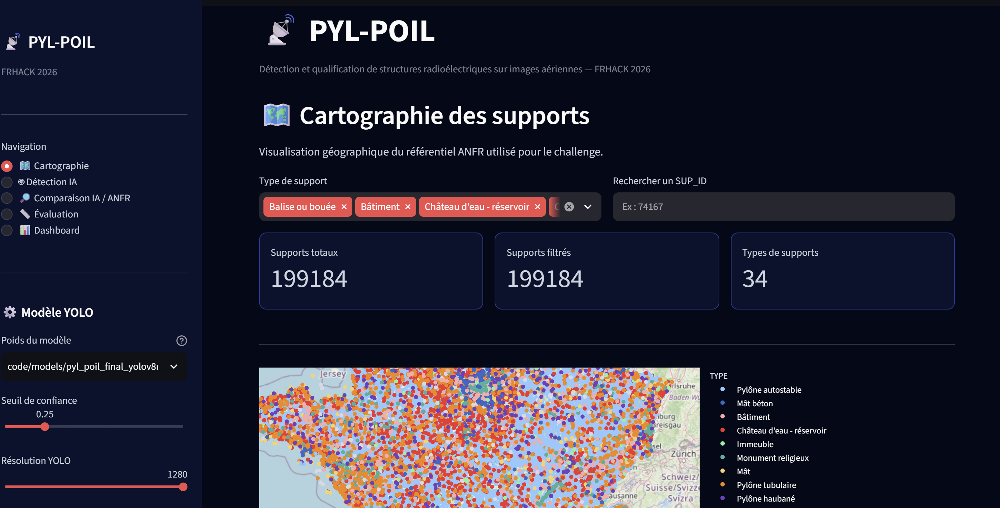
L'application *PYL-POIL* permet de visualiser les supports radio de l'ANFR, d'effectuer des détections par intelligence artificielle sur des images aériennes et de comparer les résultats obtenus avec les données de référence de l'ANFR.

Une fois l'application lancée, la navigation s'effectue depuis le menu situé dans la barre latérale gauche.


### 1. 🗺️ Cartographie

La page *Cartographie* permet de visualiser les supports radio de l'ANFR directement sur une carte.

Les supports sont représentés sous forme de points et peuvent être filtrés selon leur type.

#### Fonctionnalités disponibles

- Affichage de l'ensemble des supports sur une carte interactive.
- Filtrage des supports par *type*.
- Recherche d'un support à partir de son *SUP_ID*.
- Affichage du nombre total de supports.
- Affichage du nombre de supports après filtrage.
- Affichage du nombre de types de supports présents.
- Consultation des informations associées à chaque support.

Les informations disponibles comprennent notamment :

- l'identifiant du support (SUP_ID) ;
- le type de support ;
- le nom du support ;
- la nature du support ;
- sa hauteur ;
- ses coordonnées géographiques.


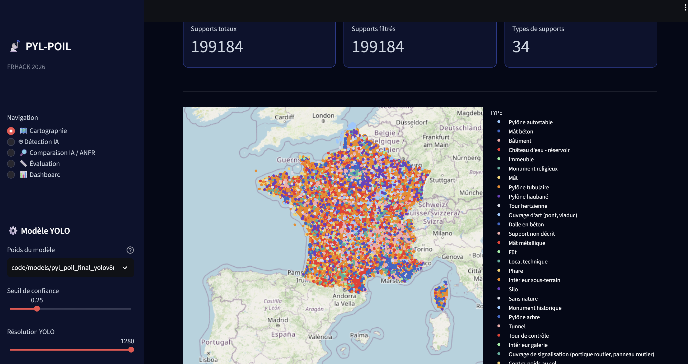


### 2. 🤖 Détection IA

La page *Détection IA* permet d'utiliser le modèle d'intelligence artificielle entraîné afin de rechercher automatiquement des structures radio sur une image aérienne.

#### Étape 1 — Importer une image

Cliquez sur *"Choisir une image"* puis sélectionnez une image au format :

- .jpg
- .jpeg
- .png
- .webp

L'image doit correspondre à une image aérienne pouvant être analysée par le modèle.

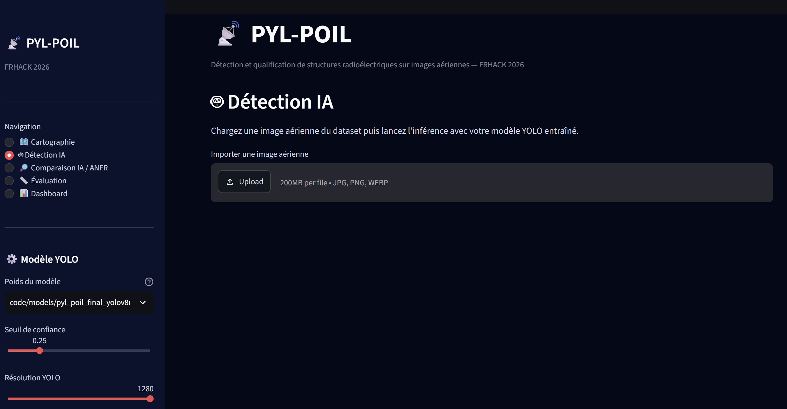

#### Étape 2 — Sélectionner les paramètres

Dans la barre latérale, plusieurs paramètres peuvent être configurés.

*Seuil de confiance*

Le seuil de confiance permet de contrôler le niveau de confiance minimal demandé au modèle pour conserver une détection.

Plus le seuil est élevé, moins le modèle conserve de détections.

*Taille d'image*

La taille utilisée pour l'inférence peut être sélectionnée parmi plusieurs valeurs :

- 640
- 768
- 960
- 1280

*Rayon de correspondance*

Le rayon de correspondance permet de déterminer si une détection est suffisamment proche de la position connue par l'ANFR.

La valeur par défaut est de *20 mètres*.


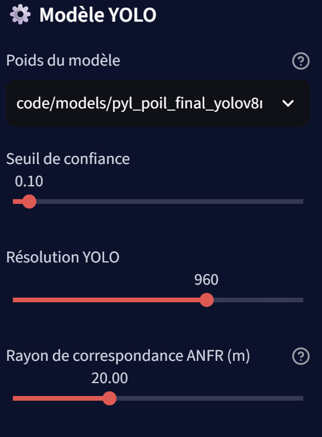

#### Étape 3 — Lancer la détection

Après avoir importé l'image et configuré les paramètres, cliquez sur :

*"🚀 Lancer la détection"*

Le modèle analyse alors l'image et recherche les structures correspondant aux classes qu'il a apprises.

Pour chaque détection, l'application affiche notamment :

- la classe détectée ;
- le niveau de confiance ;
- la position de la détection ;
- la distance entre le centre de la détection et la position ANFR.

Les détections sont ensuite affichées directement sur l'image.


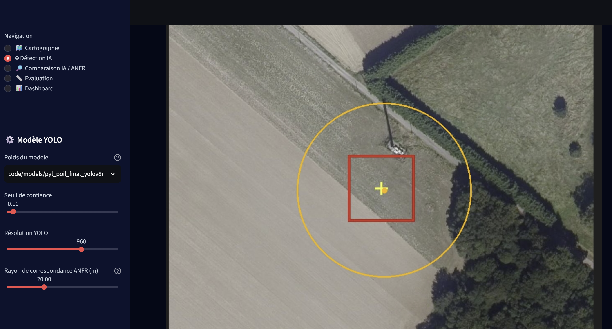

#### Interprétation des couleurs

Les résultats sont affichés avec des couleurs permettant de comparer rapidement les détections avec la position connue par l'ANFR.

- 🟢 *Vert* : la détection se trouve dans le rayon de correspondance défini autour de la position ANFR.
- 🔴 *Rouge* : la détection se trouve en dehors de ce rayon.
- 🟡 *Jaune* : position de référence fournie par l'ANFR.

> *Attention :* une détection située en dehors de la position ANFR ne signifie pas automatiquement qu'il s'agit d'un site non déclaré. Il peut notamment s'agir d'un faux positif, d'un décalage entre la position ANFR et la position réelle du support, d'une différence de date entre les données et l'image ou encore d'une installation récemment ajoutée ou supprimée.


### 3. 🔎 Comparaison IA / ANFR

La page *Comparaison IA / ANFR* permet de comparer les détections réalisées par le modèle avec les informations de référence de l'ANFR.

Cette page s'appuie sur la dernière détection réalisée dans l'application.

#### Informations affichées

L'application présente notamment :

- le nombre total de détections ;
- le nombre de détections correspondant à une référence ANFR ;
- le nombre d'anomalies détectées.

Un tableau permet également de consulter le détail des correspondances.

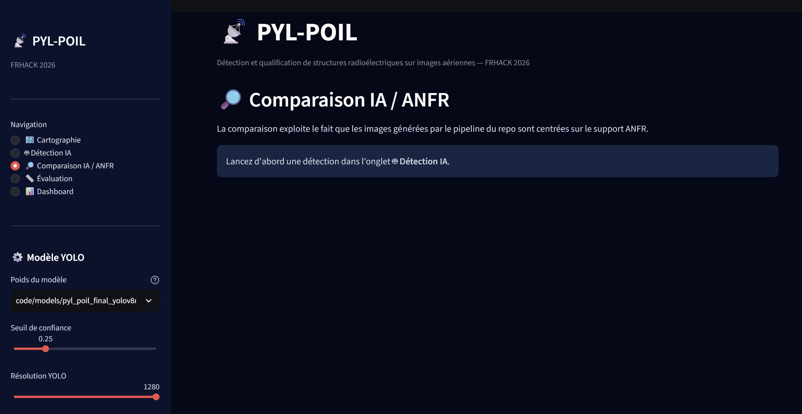

#### Interprétation

Une détection qui ne correspond pas à une référence ANFR peut avoir plusieurs explications :

- faux positif du modèle ;
- décalage géographique entre la position ANFR et la structure réellement visible ;
- différence de date entre les données ANFR et l'image aérienne ;
- installation récente ou supprimée ;
- erreur de classification du modèle.

La comparaison permet donc d'identifier les zones nécessitant une *vérification humaine*.


### 4. 📏 Évaluation

La page *Évaluation* permet d'évaluer les performances du modèle de détection.

L'évaluation utilise le jeu de données défini dans le fichier data.yaml ou antennes.yaml lorsqu'il est disponible.

Cliquez sur :

*"🚀 Évaluer le modèle"*

pour lancer l'évaluation.

Les principales métriques affichées sont :

- *mAP@50* : précision moyenne du modèle avec un seuil IoU de 0,50 ;
- *mAP@50-95* : précision moyenne calculée sur plusieurs seuils IoU ;
- *Precision* : proportion des détections effectuées par le modèle qui sont correctes ;
- *Recall* : proportion des objets réellement présents qui sont correctement détectés.


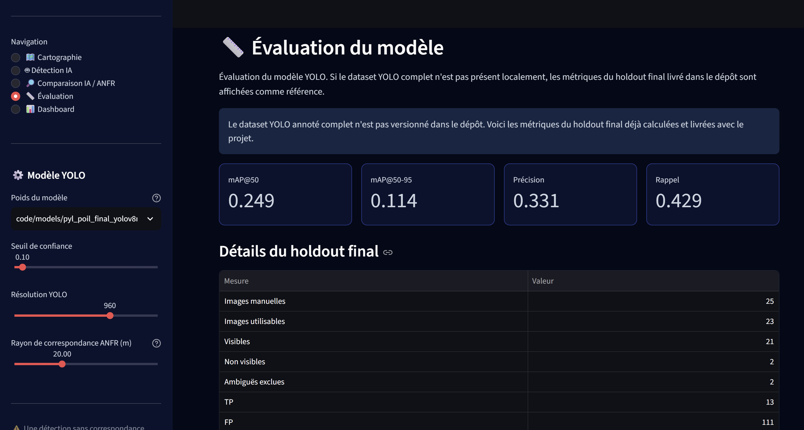

> *Important :* l'évaluation automatique du modèle ne remplace pas la validation manuelle. Pour obtenir une évaluation fiable, il est recommandé de conserver un jeu de données de validation indépendant et correctement annoté.


### 5. 📊 Dashboard

La page *Dashboard* fournit une vue synthétique des données utilisées dans l'application.

Elle présente notamment :

- le nombre total de supports ;
- le nombre total de types de supports ;
- le nombre de supports disposant de coordonnées valides ;
- la répartition des supports par type.

Des graphiques permettent de visualiser rapidement la distribution des différents types de supports.


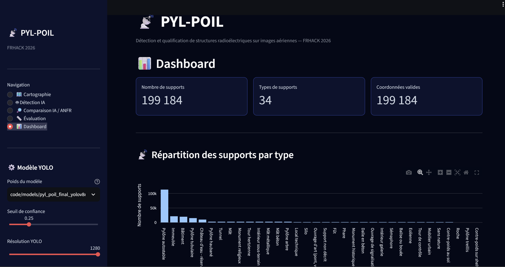

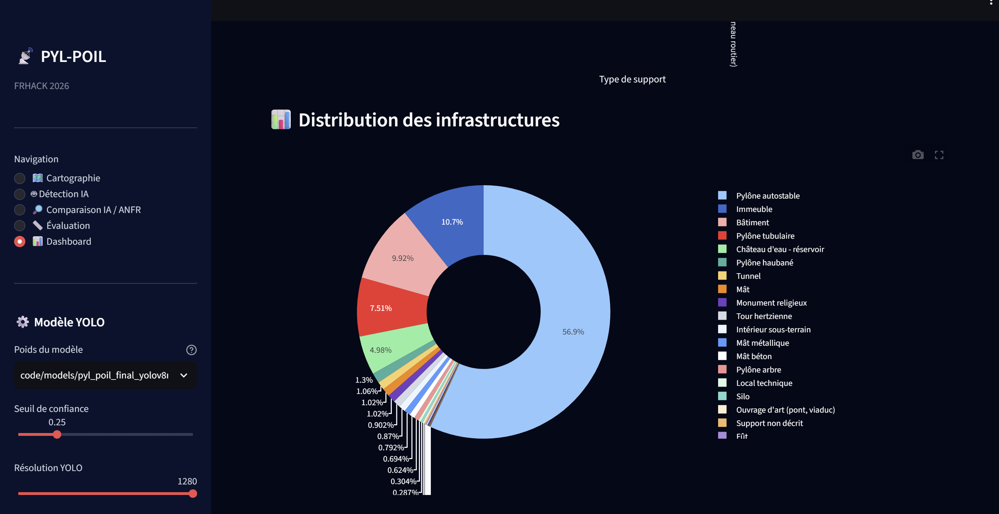


## Paramètres disponibles

Les paramètres de détection sont accessibles depuis la barre latérale gauche.

| Paramètre | Description |
|---|---|
| *Modèle YOLO* | Modèle utilisé pour effectuer les détections |
| *Seuil de confiance* | Niveau de confiance minimal pour conserver une détection |
| *Taille d'image* | Résolution utilisée lors de l'inférence |
| *Rayon de correspondance* | Distance maximale utilisée pour rapprocher une détection de la position ANFR |

Le *rayon de correspondance* est particulièrement important pour l'interprétation des résultats. Une valeur faible permet une comparaison plus stricte, tandis qu'une valeur plus élevée prend davantage en compte les éventuels décalages entre les coordonnées ANFR et la position réellement visible sur l'image.


## Workflow recommandé

Pour utiliser efficacement l'application, le workflow suivant est recommandé :

1. Consulter la *Cartographie* afin d'explorer les supports ANFR.
2. Sélectionner une image aérienne dans *Détection IA*.
3. Configurer le seuil de confiance, la taille d'image et le rayon de correspondance.
4. Lancer la détection.
5. Examiner visuellement les détections obtenues.
6. Utiliser *Comparaison IA / ANFR* pour identifier les différences entre les prédictions du modèle et les données ANFR.
7. Vérifier manuellement les détections qui semblent inhabituelles.
8. Consulter *Évaluation* pour analyser les performances globales du modèle.
9. Utiliser le *Dashboard* pour obtenir une vision synthétique des données.


## ⚠️ Points d'attention

Les résultats fournis par l'intelligence artificielle doivent être considérés comme une *aide à l'analyse* et non comme une preuve définitive de la présence ou de l'absence d'un support.

En particulier, une différence entre une détection et une donnée ANFR peut être liée à :

- une erreur du modèle ;
- un faux positif ;
- une imprécision de la position ANFR ;
- une différence temporelle entre les données et l'image ;
- une modification du site ;
- une structure visible sur l'image mais non présente dans les données de référence.

Une *validation humaine* reste donc nécessaire avant de tirer une conclusion définitive.


## Reproduire la démarche du hackathon

Les scripts sont nommés selon leur fonction, sans dépendre des anciens numéros d'expérimentation :

| Objectif | Commande |
|---|---|
| reconstruire le catalogue ANFR 78 | `python scripts/prepare_anfr_reference.py ...` |
| reproduire la sélection 300 + split spatial | `python scripts/select_level1_supports.py` |
| retélécharger les 300 images | `python scripts/download_training_imagery.py` |
| reconstruire le dataset faible Niveau 1 | `python scripts/build_level1_weak_dataset.py` |
| reconstruire le dataset humain final | `python scripts/build_training_dataset.py` |
| entraîner un modèle | `python scripts/train_model.py --data ...` |
| évaluer un modèle YOLO | `python scripts/evaluate_model.py --weights ... --data ...` |
| reproduire la sélection des 3 zones | `python scripts/select_level3_zones.py` |
| recalibrer l'écart ANFR / centre visuel | `python scripts/calibrate_anfr_distance.py` |
| relancer les 3 zones avec l'imagerie IGN actuelle | `python scripts/reproduce_level3_multizone.py` |
| rejouer exactement filtre 150 m + déduplication sur les 174 détections sauvegardées | `python scripts/rebuild_level3_candidates.py` |
| régénérer la carte finale | `python scripts/generate_reference_map.py` |
| régénérer les figures du rapport | `python scripts/generate_result_figures.py` |
| vérifier les résultats livrés | `python scripts/verify_reference_results.py` |

### Modèles livrés

- `models/pyl_poil_level1_weak_baseline.pt` — baseline Niveau 1 issue des annotations faibles ;
- `models/pyl_poil_final_yolov8n.pt` — modèle final Niveau 2, YOLOv8n initialisé COCO, sans rotation forcée.

Leurs SHA-256 sont dans `models/models_manifest.json`.

## Choix techniques importants

Les paramètres communs sont dans `config/default.yaml` : orthophotos IGN `ORTHOIMAGERY.ORTHOPHOTOS`, zoom 19, patches 1024×1024, grille 5×5, confiance YOLO 0,05, NMS IoU 0,50, filtre ANFR 150 m et déduplication 30 m.

Le seuil de **150 m** a été calibré sur **175 supports visibles** du train + validation : médiane 11,73 m, P95 30,71 m, maximum 50,49 m. Il est volontairement conservateur et n'a aucune valeur réglementaire. La figure correspondante est `code/results/figures/overview/07_anfr_distance_calibration.png`.

## Aire géographique

L'étude porte sur les **Yvelines (78)**. Le catalogue préparé contient 1 464 supports, avec une diversité suffisante de bâtiments, pylônes, mâts et autres natures tout en restant compatible avec le temps de calcul du hackathon.

Le Niveau 3 compare trois contextes automatiquement sélectionnés et éloignés :

- dense : 16 supports à 500 m ;
- intermédiaire : 3 supports à 500 m ;
- peu dense : 1 support à 500 m.

Cette comparaison met en évidence une limite importante : le taux de candidats visuellement plausibles après filtre/déduplication est 95,5 % dans la zone dense, 40,0 % dans l'intermédiaire et 21,1 % dans la zone peu dense.

## Résultats et illustrations

Les éléments directement réutilisables dans le PDF ou le PowerPoint sont indexés dans `code/results/figures/README.md`. On y trouve notamment : diversité des supports, couverture des annotations, types visuels, comparaison d'expériences, métriques du holdout, courbe d'entraînement, calibration 150 m, funnel Niveau 3, analyse par zone, hard negatives et montage des trois candidats finaux.

Les trois candidats retenus sont **D003 (mât), D006 (bâtiment) et D007 (bâtiment)**. Images, coordonnées, confiance, distance au support ANFR le plus proche et liens Cartoradio sont dans `code/results/level3/`.

## Structure du dossier

```text
code/
├── README.md
├── requirements.txt
├── pyproject.toml
├── config/                    # paramètres communs
├── src/pyl_poil/              # bibliothèque de l'outil
├── scripts/                   # commandes simples et reproductibles
├── tests/                     # tests de cohérence
├── models/                    # baseline N1 + modèle final N2
├── data/
│   ├── reference/             # catalogue ANFR, sélection et split
│   ├── annotations/           # annotations humaines
│   └── level3/                # détections et données de reproduction N3
├── results/
│   ├── metrics/
│   ├── training_history/
│   ├── evaluation/
│   ├── error_analysis/
│   ├── figures/
│   └── level3/
└── docs/
    ├── CHALLENGE4_COVERAGE.md
    ├── METHODOLOGY.md
    ├── RESULTS.md
    ├── VALIDATION.md
    └── TEST_REPORT.md
```

Les centaines d'orthophotos, caches WMTS et checkpoints intermédiaires ne sont volontairement pas versionnés : ils alourdissent le dépôt et sont reconstructibles.

## Sources

- **ANFR** — référentiel ouvert des supports/installations radioélectriques ;
- **IGN / GeoPF** — orthophotos par WMTS `https://data.geopf.fr/wmts` ;
- **Cartoradio** — vérification cartographique via une URL `.../lonlat/<longitude>/<latitude>` ;
- **Ultralytics YOLOv8** — détection d'objets.

## Tests et validation

```bash
python -m compileall -q src scripts tests
PYTHONPATH=src python -m unittest discover -s tests -v
PYTHONPATH=src python scripts/verify_reference_results.py
```

Le rapport exact des contrôles exécutés se trouve dans `docs/TEST_REPORT.md`.

Pour vérifier explicitement comment le dossier répond à chaque attente de la fiche du Challenge 4, lire **`docs/CHALLENGE4_COVERAGE.md`**.
