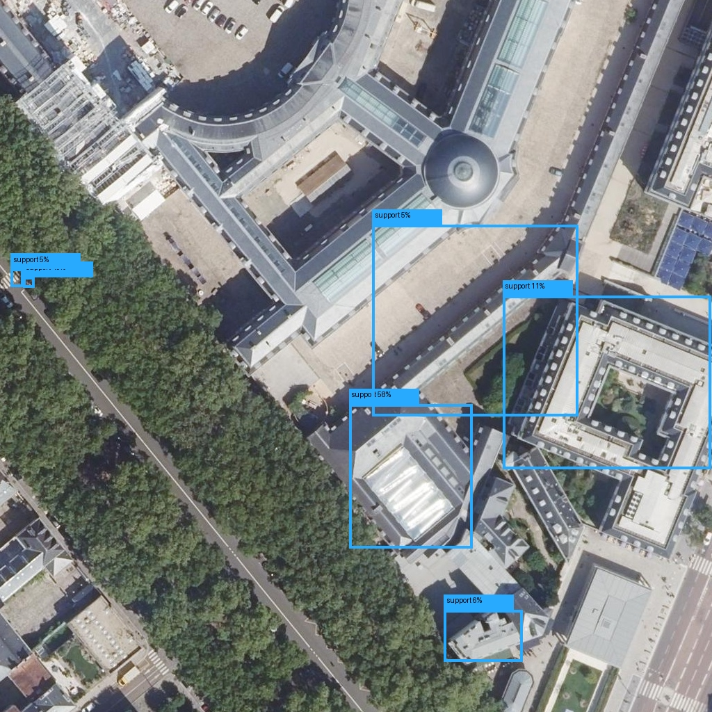

# Pyl-Poil — FrHack! 2026 · Challenge 4 ANFR × ISEP

**Pyl-Poil** est un outil Python de détection et d'analyse de **structures susceptibles de supporter des installations radioélectriques** à partir d'orthophotographies aériennes IGN.

Le projet associe :

- un **référentiel ANFR** de supports connus ;
- des **orthophotographies IGN / GeoPF** ;
- un modèle de détection **YOLOv8n** ;
- une chaîne de **géolocalisation et de comparaison spatiale** ;
- une recherche de **candidats visuels** éloignés des supports ANFR connus ;
- une **interface Streamlit** pour la démonstration et l'exploration ;
- des scripts reproductibles pour reconstruire les données, réentraîner, évaluer et reproduire les résultats du hackathon.

> [!IMPORTANT]
> Une détection sans correspondance ANFR proche est un **candidat à examiner**, jamais une preuve automatique de site radioélectrique non déclaré. Elle peut correspondre à un faux positif, à un support sans installation radio, à un décalage géographique ou temporel, à une installation récente ou démantelée, ou à une erreur de classification.

---

## Sommaire

- [1. Résultats principaux](#1-résultats-principaux)
- [2. Architecture du projet](#2-architecture-du-projet)
- [3. Démarrage rapide](#3-démarrage-rapide)
- [4. Installation](#4-installation)
- [5. Utiliser l'application Streamlit](#5-utiliser-lapplication-streamlit)
- [6. Utiliser le moteur Pyl-Poil en ligne de commande](#6-utiliser-le-moteur-pyl-poil-en-ligne-de-commande)
- [7. Générer les images et reproduire les données](#7-générer-les-images-et-reproduire-les-données)
- [8. Méthodologie du hackathon](#8-méthodologie-du-hackathon)
- [9. Modèles et paramètres](#9-modèles-et-paramètres)
- [10. Évaluation et validation](#10-évaluation-et-validation)
- [11. Niveau 3 — recherche de candidats](#11-niveau-3--recherche-de-candidats)
- [12. Limites et précautions d'interprétation](#12-limites-et-précautions-dinterprétation)
- [13. Tests techniques](#13-tests-techniques)
- [14. Structure du dépôt](#14-structure-du-dépôt)
- [15. Sources](#15-sources)

---

# 1. Résultats principaux

L'étude scientifique du hackathon a été menée sur le département des **Yvelines (78)**.

| Étape | Résultat |
|---|---:|
| Catalogue ANFR Yvelines | **1 464 supports** |
| Dataset initial | **300 supports** |
| Split spatial | **210 train / 45 validation / 45 test** |
| Niveau 1 — mAP50 sur test humain initial | **0,0126** |
| Niveau 2 — train revu manuellement | **210 images, 165 utilisables** |
| Niveau 2 — validation revue | **45 images, 35 utilisables** |
| Holdout final indépendant | **25 images, 23 utilisables** |
| Modèle final — mAP50 holdout | **0,2495** |
| Modèle final — mAP50-95 holdout | **0,1138** |
| Niveau 3 — détections brutes | **174** |
| Après filtre géographique ≥ 150 m | **53** |
| Après déduplication à 30 m | **46 candidats uniques** |
| Revue humaine | **27 plausibles · 17 faux positifs · 2 incertains** |
| Cas présentés | **D003 · D006 · D007** |

Les résultats consolidés sont disponibles dans :

```text
code/results/
├── metrics/
├── evaluation/
├── error_analysis/
├── figures/
├── training_history/
└── level3/
```

---

# 2. Architecture du projet

Pyl-Poil est organisé en **deux couches complémentaires**.

### Interface utilisateur

Le fichier :

```text
app.py
```

correspond à l'application **Streamlit** utilisée pour l'exploration et la démonstration.

Elle permet notamment :

- de cartographier les supports ANFR ;
- de charger une orthophotographie aérienne ;
- de lancer une inférence YOLO ;
- d'afficher les bounding boxes et confiances ;
- de comparer une détection à une référence ANFR lorsque la géométrie de l'image est connue ;
- de consulter les métriques d'évaluation ;
- d'explorer un dashboard synthétique.

### Moteur scientifique

Le dossier :

```text
code/
```

contient le moteur reproductible du projet :

- téléchargement d'imagerie IGN ;
- préparation des références ANFR ;
- génération des datasets ;
- entraînement ;
- évaluation ;
- géolocalisation des détections ;
- filtrage spatial ;
- déduplication ;
- cartographie ;
- reproduction des résultats Niveau 1, Niveau 2 et Niveau 3.

### Pipeline général

```mermaid
flowchart LR
    A[Référentiel ANFR] --> B[Sélection géographique]
    B --> C[Orthophotos IGN / GeoPF]
    C --> D[Détection YOLO]
    D --> E[Géolocalisation]
    E --> F[Distance au support ANFR le plus proche]
    F --> G[Filtre Niveau 3 ≥ 150 m]
    G --> H[Déduplication 30 m]
    H --> I[Revue humaine]
    I --> J[Carte interactive / candidats]
```



---

# 3. Démarrage rapide

Depuis la racine du dépôt :

```bash
git clone https://github.com/Landrysgl/Hackathon_FRHACK_26.git
cd Hackathon_FRHACK_26
```

Créez ensuite un environnement Python.

### Linux / macOS / Onyxia

```bash
python -m venv .venv
source .venv/bin/activate
```

### Windows PowerShell

```powershell
py -m venv .venv_windows
.\.venv_windows\Scripts\Activate.ps1
```

Installez l'application :

```bash
python -m pip install --upgrade pip
python -m pip install -r requirements_app.txt
```

Pour disposer aussi de l'ensemble du moteur Pyl-Poil :

```bash
python -m pip install -e ./code
```

Lancez ensuite l'interface :

```bash
python -m streamlit run app.py
```

Puis ouvrez :

```text
http://localhost:8501
```

> `app.py` est une application Streamlit. Ne pas la lancer avec `python app.py`.

---

# 4. Installation

## 4.1 Installation locale

Prérequis recommandés :

- Python récent ;
- Git ;
- une connexion Internet pour télécharger l'imagerie IGN lors des reproductions ;
- GPU recommandé pour les entraînements, mais non obligatoire pour une inférence simple.

Installation de l'interface :

```bash
python -m pip install -r requirements_app.txt
```

Installation du moteur :

```bash
python -m pip install -e ./code
```

Les dépendances scientifiques du moteur sont également décrites dans :

```text
code/requirements.txt
```

---

## 4.2 Installation sur Onyxia

1. Créer un service **VSCode Python GPU**.


2. Dans **Initialization scripts**, renseigner si nécessaire le script d'initialisation suivant :

```text
https://raw.githubusercontent.com/Landrysgl/Hackathon_FRHACK_26/main/onyxia-init.sh
```


3. Dans la configuration réseau, activer l'accès à un port spécifique et ouvrir le port **8501**, utilisé par Streamlit.


4. Enregistrer la configuration, lancer le service puis ouvrir VS Code.


5. Cloner le dépôt puis se placer à sa racine :

```bash
git clone https://github.com/Landrysgl/Hackathon_FRHACK_26.git
cd Hackathon_FRHACK_26
```

6. Installer les dépendances de l'application et du moteur :

```bash
python -m pip install -r requirements_app.txt
python -m pip install -e ./code
```

7. Lancer l'application :

```bash
python -m streamlit run app.py
```

8. Depuis la page **Mes services** d'Onyxia, ouvrir le service puis suivre le lien associé au port **8501**.


Si OpenCV échoue avec :

```text
ImportError: libGL.so.1: cannot open shared object file
```

installer la bibliothèque système :

```bash
sudo apt-get update
sudo apt-get install -y libgl1
```

Si l'installation système n'est pas autorisée, utiliser OpenCV headless :

```bash
python -m pip uninstall -y opencv-python opencv-contrib-python
python -m pip install opencv-python-headless
```

---

# 5. Utiliser l'application Streamlit

L'interface Streamlit constitue la couche de démonstration et d'exploration de Pyl-Poil. Elle s'appuie sur le modèle final et sur le référentiel ANFR disponible dans le dépôt.

L'application comporte cinq espaces :

1. **Cartographie**
2. **Détection IA**
3. **Comparaison IA / ANFR**
4. **Évaluation**
5. **Dashboard**

La barre latérale permet également de sélectionner le modèle et de régler les paramètres d'inférence.

---

## 5.1 Cartographie

La page **Cartographie** permet d'explorer le référentiel ANFR chargé par l'application.

Dans la configuration illustrée ci-dessous, l'application utilise `SUP_SUPPORT_AVEC_TYPE.csv`, soit **199 184 supports** répartis en **34 types**. La barre latérale confirme également que le modèle final `code/models/pyl_poil_final_yolov8n.pt` est sélectionné.


Fonctionnalités principales :

- visualisation géographique des supports ;
- filtrage par type de support ;
- recherche par `SUP_ID` ;
- consultation des informations disponibles ;
- affichage du nombre de supports et du nombre de types.

La carte nationale permet d'observer la répartition spatiale du référentiel chargé.


### Référentiel utilisé par l'application

L'application peut exploiter :

1. `SUP_SUPPORT_AVEC_TYPE.csv` à la racine du projet, pour la cartographie étendue ;
2. `code/data/reference/supports_yvelines.csv`, utilisé par le pipeline scientifique centré sur les Yvelines.

> L'affichage national de l'application ne signifie pas que le modèle a été entraîné sur toute la France. Les entraînements et les métriques présentés dans ce projet reposent principalement sur les **Yvelines (78)**.

---

## 5.2 Détection IA

La page **Détection IA** permet de charger une image aérienne brute puis d'exécuter le modèle YOLO final.


### Images à utiliser

Pour obtenir un test représentatif, utiliser de préférence :

- une **orthophotographie aérienne brute** ;
- une image issue du pipeline IGN / GeoPF ;
- une image sans rectangle, texte ou annotation préalable.

Éviter :

- les captures d'écran de navigateur ;
- les photos prises au sol ;
- les montages ;
- les images déjà annotées ;
- les images fortement redimensionnées ou issues d'un domaine visuel très différent des données d'entraînement.

Formats acceptés :

```text
.jpg
.jpeg
.png
.webp
```

### Paramètres d'inférence

Les réglages recommandés pour le modèle final sont :

| Paramètre | Valeur recommandée |
|---|---:|
| Modèle | `code/models/pyl_poil_final_yolov8n.pt` |
| Seuil de confiance | **0,05** |
| Résolution YOLO | **1024 px** |
| IoU NMS | **0,50** |
| Rayon local de proximité ANFR | **50 m** |
| Emprise supposée pour une image locale centrée | **100 m × 100 m** |



Le seuil de confiance de **0,05** est volontairement faible : il privilégie le rappel et permet de faire remonter davantage de structures potentielles. En contrepartie, des faux positifs peuvent apparaître et doivent ensuite être filtrés et interprétés.

### Résultat d'une inférence

L'application dessine les bounding boxes prédites directement sur l'orthophotographie et indique pour chacune la classe et la confiance du modèle.


Une image brute peut générer plusieurs propositions, y compris à faible confiance. Ce comportement est cohérent avec le choix d'un seuil exploratoire à `0,05`.

> Une bounding box est une **proposition du détecteur**, pas une confirmation qu'une installation radioélectrique est présente.

---

## 5.3 Comparaison IA / ANFR

La page **Comparaison IA / ANFR** réutilise la dernière inférence réalisée dans l'onglet **Détection IA**.

Elle est destinée aux images pour lesquelles on connaît la relation entre l'image et une position ANFR de référence, notamment lorsqu'un patch a été généré en étant centré sur un support connu.


Si aucune inférence n'a encore été exécutée dans la session, l'application demande d'abord de lancer une détection.

Lorsque les informations spatiales nécessaires sont disponibles, cette page peut aider à distinguer :

- une détection proche de la position de référence ;
- une détection éloignée ;
- l'absence de détection autour d'un support attendu.

### Deux distances à ne pas confondre

Le **rayon local de 50 m** affiché dans l'application sert uniquement à l'interprétation d'une image locale centrée.

Le pipeline de recherche de candidats du **Niveau 3** utilise une règle différente :

```text
distance au support ANFR le plus proche ≥ 150 m
```

puis une déduplication à **30 m**.

Ces deux valeurs répondent donc à deux usages différents.

> Une détection éloignée d'une position ANFR n'est jamais automatiquement un site non déclaré.

---

## 5.4 Évaluation

La page **Évaluation** présente les performances du modèle.

Lorsque le dataset YOLO complet n'est pas disponible localement, l'application affiche directement les métriques du **holdout final indépendant** livré avec le projet.


Les métriques de référence affichées sont :

| Métrique | Valeur |
|---|---:|
| mAP@50 | **0,249** |
| mAP@50-95 | **0,114** |
| Précision Ultralytics | **0,331** |
| Rappel Ultralytics | **0,429** |

Le holdout comporte :

- **25** images annotées manuellement ;
- **23** images utilisables ;
- **21** cas visibles ;
- **2** cas non visibles ;
- **2** cas ambigus exclus.

À `conf = 0,05` et avec un IoU de correspondance de `0,50`, les comptages sauvegardés sont :

```text
TP = 13
FP = 111
FN = 8
```

Ces valeurs montrent pourquoi Pyl-Poil doit être utilisé comme un outil de **présélection et d'aide à l'analyse**, et non comme un système de décision automatique.

---

## 5.5 Dashboard

Le **Dashboard** fournit une synthèse du référentiel ANFR chargé dans l'application.

Il affiche notamment :

- le nombre total de supports ;
- le nombre de types de supports ;
- le nombre de coordonnées valides ;
- la distribution des supports par type.

Le graphique en barres permet de comparer les effectifs entre les différentes catégories.


Une seconde visualisation présente la distribution relative sous forme de diagramme en anneau.


Ces graphiques décrivent le **référentiel ANFR chargé par l'application**. Ils ne représentent pas la distribution des annotations du dataset d'entraînement YOLO.

---

# 6. Utiliser le moteur Pyl-Poil en ligne de commande

Depuis la **racine du dépôt**, une analyse complète d'une zone peut être lancée avec :

```bash
python code/scripts/analyze_area.py \
  --lat 48.7975 \
  --lon 2.1300 \
  --supports code/data/reference/supports_yvelines.csv \
  --weights code/models/pyl_poil_final_yolov8n.pt \
  --config code/config/default.yaml \
  --output code/outputs/demo_dense \
  --zone-id demo_dense \
  --device 0
```

Pour une exécution CPU, utiliser si nécessaire :

```text
--device cpu
```

Sorties principales :

```text
code/outputs/demo_dense/
├── imagery/
│   └── metadata_patches.csv
├── detections.csv
├── detections_hors_correspondance_anfr.csv
├── candidats_uniques.csv
├── carte_candidats.html
└── resume.json
```

Après :

```bash
python -m pip install -e ./code
```

la bibliothèque Pyl-Poil peut également être utilisée comme paquet Python.

---

# 7. Générer les images et reproduire les données

## 7.1 Retélécharger les 300 images du Niveau 1

La sélection initiale des supports est reconstruite avec :

```bash
python code/scripts/select_level1_supports.py
```

Puis les orthophotographies correspondantes peuvent être téléchargées avec :

```bash
python code/scripts/download_training_imagery.py
```

Ces scripts utilisent l'imagerie aérienne IGN / GeoPF.

> Les centaines d'orthophotos ne sont volontairement pas toutes versionnées dans Git, afin de conserver un dépôt raisonnable. Elles sont reconstructibles.

---

## 7.2 Reconstituer les datasets

Dataset faible Niveau 1 :

```bash
python code/scripts/build_level1_weak_dataset.py
```

Dataset d'entraînement final :

```bash
python code/scripts/build_training_dataset.py
```

---

## 7.3 Générer de nouvelles zones et détections candidates

Pour analyser une zone précise :

```bash
python code/scripts/analyze_area.py --help
```

Pour reproduire les trois zones du Niveau 3 :

```bash
python code/scripts/select_level3_zones.py
python code/scripts/reproduce_level3_multizone.py
```

Pour reconstruire les candidats à partir des détections sauvegardées :

```bash
python code/scripts/rebuild_level3_candidates.py
```

Pour régénérer la carte finale :

```bash
python code/scripts/generate_reference_map.py
```

---

# 8. Méthodologie du hackathon

## Niveau 1 — annotations faibles

Les coordonnées ANFR ont d'abord été utilisées comme **weak labels** afin de générer automatiquement un premier dataset.

Cette approche est rapide, mais les coordonnées administratives ne correspondent pas toujours exactement à l'objet visible sur l'orthophotographie.

Le Niveau 1 a donc servi de baseline et a mis en évidence la nécessité d'une vérité terrain humaine.

---

## Niveau 2 — annotations humaines et amélioration du détecteur

Les images d'entraînement et de validation ont été revues manuellement afin de distinguer notamment :

- objet visible ;
- objet non visible ;
- cas ambigu.

Des types visuels ont également été renseignés lorsque possible :

- bâtiment ;
- pylône ;
- mât ;
- château d'eau ;
- autre.

Plusieurs variantes d'entraînement ont été comparées. Le modèle final retenu est un **YOLOv8n initialisé sur COCO, sans rotation forcée**.

---

## Niveau 3 — recherche de candidats

Le Niveau 3 ne cherche plus uniquement à retrouver un support ANFR connu.

Il cherche des détections :

1. produites par YOLO ;
2. géolocalisées ;
3. situées à au moins **150 m** du support ANFR le plus proche ;
4. dédupliquées avec un rayon de **30 m** ;
5. soumises à une **revue humaine**.

Cette étape produit des **candidats visuels à examiner**, et non des conclusions réglementaires.

---

# 9. Modèles et paramètres

Deux checkpoints sont livrés :

```text
code/models/pyl_poil_level1_weak_baseline.pt
code/models/pyl_poil_final_yolov8n.pt
```

Leurs empreintes SHA-256 sont référencées dans :

```text
code/models/models_manifest.json
```

Paramètres communs du pipeline final :

| Paramètre | Valeur |
|---|---:|
| Source d'imagerie | IGN / GeoPF |
| Couche | `ORTHOIMAGERY.ORTHOPHOTOS` |
| Zoom | **19** |
| Taille d'un patch | **1024 × 1024 px** |
| Grille Niveau 3 | **5 × 5** |
| Seuil YOLO | **0,05** |
| IoU NMS | **0,50** |
| Distance candidat Niveau 3 | **≥ 150 m** |
| Déduplication | **30 m** |

Configuration :

```text
code/config/default.yaml
```

---

# 10. Évaluation et validation

## Holdout final indépendant

Le modèle final a été évalué sur un jeu indépendant de **25 images**, dont **23 utilisables** après revue.

Résultats :

```text
mAP50       = 0.2495
mAP50-95    = 0.1138
```

À `conf = 0.05`, le modèle privilégie le rappel, au prix d'un nombre élevé de faux positifs.

Cette caractéristique est cohérente avec l'usage Niveau 3 : le détecteur sert d'abord à **faire remonter des objets potentiellement intéressants**, puis les traitements spatiaux et la revue humaine réduisent les erreurs.

---

# 11. Niveau 3 — recherche de candidats

## Calibration du seuil de 150 m

Le décalage entre coordonnées ANFR et centres visuels a été mesuré sur **175 supports visibles** issus du train et de la validation.

Valeurs observées :

| Statistique | Distance |
|---|---:|
| Médiane | **11,73 m** |
| P95 | **30,71 m** |
| P97,5 | **40,02 m** |
| P99 | **47,16 m** |
| Maximum | **50,49 m** |

Le seuil de **150 m** est donc volontairement conservateur.

Il s'agit d'un **choix méthodologique du projet**, sans valeur réglementaire.

---

## Trois contextes géographiques

Le Niveau 3 compare trois zones :

| Zone | Densité ANFR à 500 m |
|---|---:|
| Dense | **16 supports** |
| Intermédiaire | **3 supports** |
| Peu dense | **1 support** |

Résultats de la revue humaine après filtre et déduplication :

| Zone | Plausibles | FP | Incertains | Taux plausible |
|---|---:|---:|---:|---:|
| Dense | 21 | 1 | 0 | **95,5 %** |
| Intermédiaire | 2 | 2 | 1 | **40,0 %** |
| Peu dense | 4 | 14 | 1 | **21,1 %** |

Ce résultat met en évidence une limite importante : un filtre uniquement basé sur la distance se comporte différemment selon l'environnement.

---

## Candidats présentés

Les trois exemples retenus pour la restitution sont :

- **D003** — mât ;
- **D006** — bâtiment ;
- **D007** — bâtiment.

Les images, coordonnées, distances, confiances et liens Cartoradio sont disponibles dans :

```text
code/results/level3/
```

---

# 12. Limites et précautions d'interprétation

Pyl-Poil est un **outil d'aide à l'analyse**.

Les principales limites sont les suivantes :

- le modèle a été entraîné principalement sur des données des **Yvelines** ;
- sa généralisation à d'autres régions ou à d'autres résolutions d'image n'est pas garantie ;
- le seuil `0,05` favorise le rappel et augmente le nombre de faux positifs ;
- les coordonnées ANFR ne constituent pas une vérité terrain visuelle parfaite ;
- une structure détectée n'implique pas nécessairement la présence d'une installation radioélectrique ;
- les données ANFR et les orthophotos peuvent correspondre à des dates différentes ;
- une détection éloignée d'un support ANFR n'est jamais, à elle seule, une preuve de site non déclaré ;
- une validation humaine reste nécessaire.

---

# 13. Tests techniques

## Tests automatisés

Depuis la racine du dépôt :

```bash
python -m pytest -q code/tests
```

Validation effectuée sur la version livrée :

```text
14 passed
```

---

## Vérification des résultats de référence

```bash
python code/scripts/verify_reference_results.py
```

---

## Smoke test bout en bout

La chaîne complète a également été testée sur une zone réelle :

```bash
python code/scripts/analyze_area.py \
  --lat 48.7975 \
  --lon 2.1300 \
  --supports code/data/reference/supports_yvelines.csv \
  --weights code/models/pyl_poil_final_yolov8n.pt \
  --config code/config/default.yaml \
  --output code/outputs/smoke_test \
  --zone-id smoke_test \
  --device 0
```

Ce test couvre :

```text
téléchargement IGN
    ↓
inférence YOLO
    ↓
géolocalisation
    ↓
distance au référentiel ANFR
    ↓
filtrage
    ↓
déduplication
    ↓
carte HTML
    ↓
résumé JSON
```

Lors du test de référence, le modèle a produit **7 détections** sur la zone analysée.

Le fait d'obtenir `0 candidat` après le filtre Niveau 3 sur un patch donné n'est pas une erreur : une zone peut simplement ne contenir aucune détection satisfaisant les critères de candidature.

Le rapport détaillé des contrôles est disponible dans :

```text
code/docs/TEST_REPORT.md
```

---

# 14. Structure du dépôt

```text
Hackathon_FRHACK_26/
├── app.py                         # interface Streamlit
├── requirements_app.txt           # dépendances de l'interface
├── onyxia-init.sh                 # initialisation Onyxia
├── images_readme/                 # captures du README
│
├── code/
│   ├── README.md
│   ├── requirements.txt
│   ├── pyproject.toml
│   │
│   ├── config/                    # configuration du pipeline
│   ├── src/pyl_poil/              # bibliothèque Python
│   ├── scripts/                   # scripts reproductibles
│   ├── tests/                     # tests automatisés
│   ├── models/                    # checkpoints livrés
│   │
│   ├── data/
│   │   ├── reference/             # catalogue ANFR, sélection et split
│   │   ├── annotations/           # annotations humaines
│   │   └── level3/                # données de reproduction Niveau 3
│   │
│   ├── results/
│   │   ├── metrics/
│   │   ├── training_history/
│   │   ├── evaluation/
│   │   ├── error_analysis/
│   │   ├── figures/
│   │   └── level3/
│   │
│   └── docs/
│       ├── CHALLENGE4_COVERAGE.md
│       ├── METHODOLOGY.md
│       ├── RESULTS.md
│       ├── VALIDATION.md
│       └── TEST_REPORT.md
│
└── README.md                      # ce document
```

Les orthophotographies, caches WMTS et checkpoints intermédiaires lourds ne sont volontairement pas tous versionnés. Ils peuvent être reconstruits à partir des scripts du dépôt.

---

# 15. Sources

- **ANFR** — référentiel des supports et installations radioélectriques ;
- **IGN / GeoPF** — orthophotographies aériennes utilisées par le pipeline ;
- **Cartoradio** — vérification cartographique des coordonnées ;
- **Ultralytics YOLOv8** — modèle de détection d'objets.

Documentation complémentaire :

```text
code/docs/CHALLENGE4_COVERAGE.md
code/docs/METHODOLOGY.md
code/docs/RESULTS.md
code/docs/VALIDATION.md
code/docs/TEST_REPORT.md
```

---

## Avertissement final

Pyl-Poil a été développé dans le cadre du **FrHack! 2026 — Challenge 4 ANFR × ISEP**.

L'outil vise à faciliter l'analyse d'images aériennes et la priorisation de zones à examiner. Il ne remplace ni une expertise terrain, ni une vérification réglementaire, ni les données officielles de l'ANFR.
